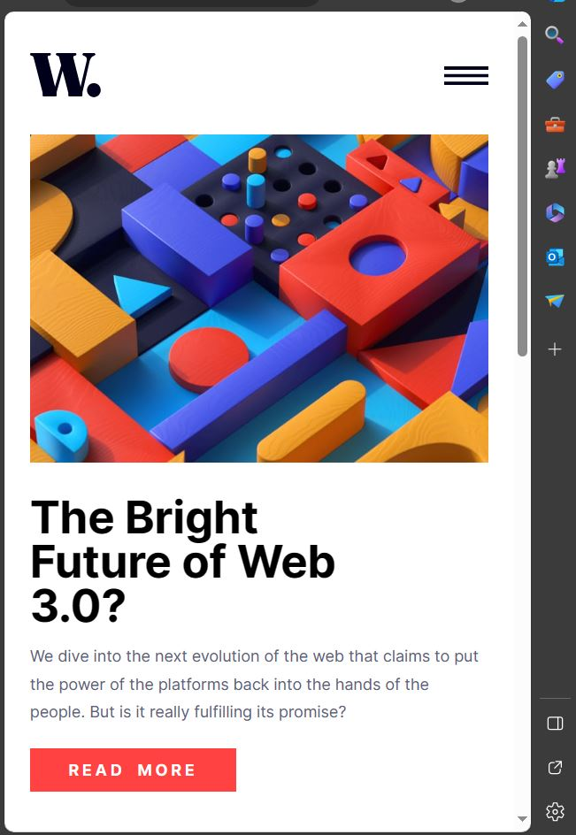
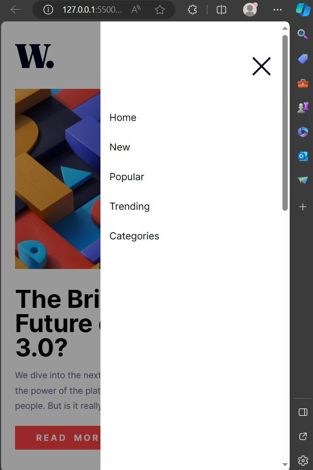

## Table of contents

- [Overview](#overview)
  - [The challenge](#the-challenge)
  - [Screenshot](#screenshot)
  - [Links](#links)
- [My process](#my-process)
  - [Built with](#built-with)
  - [Useful resources](#useful-resources)

## Overview

### The challenge

I was should be able to:

- View the optimal layout for the interface depending on their device's screen size
- See hover and focus states for all interactive elements on the page
- Add animations to the text on screen load
- use of overaly and media queries

### Screenshot

### Links

- Solution URL: (https://www.itstalalsalman.github.io/news__homepage__main/)
- Live Site URL: (https://github.com/itstalalsalman/news__homepage__main)

## My process

### Built with

- Semantic HTML5 markup
- CSS custom properties
- Flexbox
- CSS Grid
- Mobile-first workflow
- jQuery
- Vanilla JS
- CSS Animations using keyframes
- [Styled Components](https://styled-components.com/) - For styles

**Note: These are just examples. Delete this note and replace the list above with your own choices**

### Useful resources

- [Stack Overflow](https://www.stackoverflow.com) - This helped me for XYZ reason. I really liked this pattern and will use it going forward.

